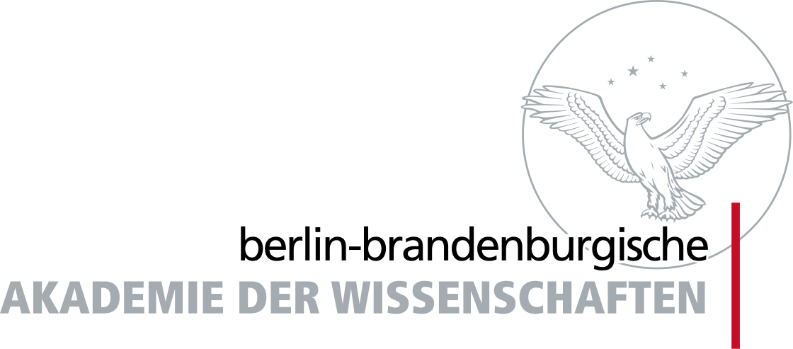

# Fabricuis Workbench Translation API

An API for suggesting translations from a sequence of [Gardiner codes](https://en.wikipedia.org/wiki/Gardiner%27s_sign_list).

This API is required by the Google Arts and Culture Fabricius Workbench, code found at [googleartsculture/workbench](https://github.com/googleartsculture/workbench). For more infomation go to the [Google Arts and Culture home page](https://experiments.withgoogle.com/fabricius) for the project.

The translation uses data from: Berlin-Brandenburg Academy of Sciences and Humanities (Berlin, Germany) and Saxon Academy of Sciences and Humanities
(Leipzig, Germany), research project  "Structure and Transformation in the Vocabulary of the Egyptian Language", CC BY-SA 4.0 Int.

## Contributing

Please read [CONTRIBUTING.md](./CONTRIBUTING.md) for details on our code of conduct, and the process for submitting pull requests to us.

## License

This project is licensed under the Apache License, Version 2.0 - see the [LICENSE.md](./LICENSE.md) file for details.
